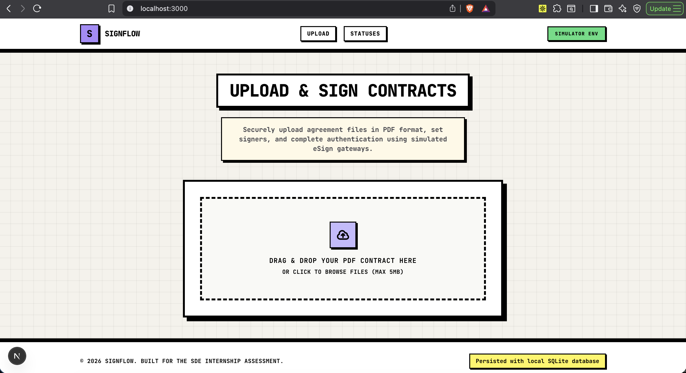
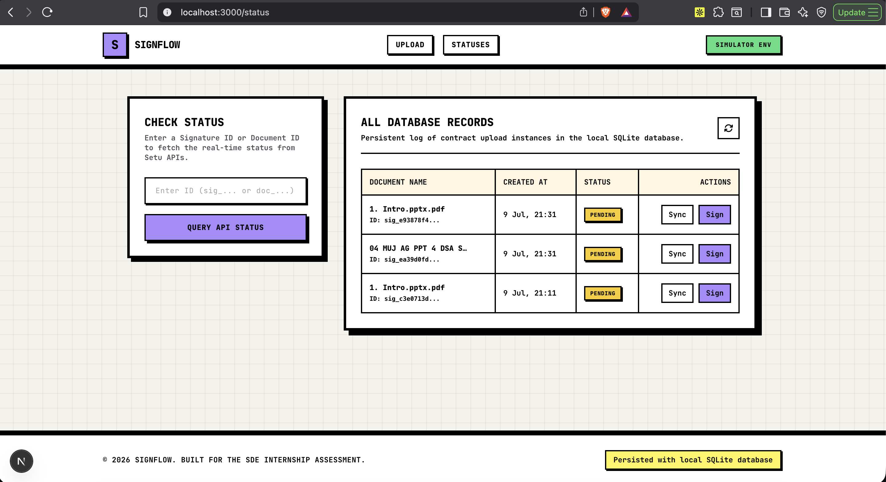

# signflow - full-stack contract signing portal & setu simulator

signflow is a developer-first, full-stack application designed to facilitate secure contract document uploads and simulated aadhaar esign verification. it satisfies all deliverables for stage 1 (postman verification), stage 2 (full-stack integration), and stage 3 (ui/ux refinement).

---

## design system & inspiration

the user interface has been redesigned with a premium neo-brutalist theme featuring:
* high-contrast layouts: solid white and bright accent containers over a custom dot-grid background.
* thick borders: bold, heavy black outlines (3px to 4px) around cards, buttons, badges, and inputs.
* hard drop shadows: snappy, solid offset shadows with zero blur (e.g. shadow-[4px_4px_0px_0px_rgba(0,0,0,1)]) to give a physical, tactile feel.
* typography: stylized with jetbrains mono as the primary typeface for headers and status codes.
* snappy micro-interactions: active buttons translate down when clicked for tactile feedback.

---

## tech stack & architecture choices

### 1. framework: next.js 15 (app router & typescript)
* why: provides a unified full-stack repository (monorepo). pages, layouts, and api route handlers share types seamlessly.
* router: app router is leveraged for dynamic segments (`[id]`) and server-side operations.

### 2. database: sqlite (via `better-sqlite3`)
* why: sqlite persists all contract metadata on-disk locally (`data/esign.db`), allowing records to survive server restarts. it has zero external dependencies, making setup effortless.
* schema:
```sql
create table contracts (
  documentid text primary key,
  signatureid text unique not null,
  signerurl text not null,
  status text not null,
  documentname text not null,
  filepath text not null,
  createdat text not null,
  updatedat text not null
);
```

### 3. styling: tailwind css v3
* why: utility classes enable rapid styling and implementation of the custom neo-brutalist border and shadow tokens without stylesheet clutter.

---

## system architecture & data flow

```
+--------------------------------------------------------+
|                      user browser                      |
+--------------------------------------------------------+
   |                                                ^
   | 1. drag & drop pdf                             | 12. auto-close iframe
   | 2. post /api/upload-contract                   |     & show download link
   v                                                |
+--------------------------------------------------------+
|                    signflow backend                    |
+--------------------------------------------------------+
   |                                                ^
   | 3. save to uploads/ & insert record            | 10. query status
   v                                                | 11. return completed
+--------------------------------------------------------+
|                     local sqlite db                    |
+--------------------------------------------------------+
   |                                                ^
   | 4. return document & signature ids             | 8. post signature id
   v                                                |
+--------------------------------------------------------+
|                     embedded iframe                    |
+--------------------------------------------------------+
   |                                                ^
   | 5. load signature url                          | 7. updates status
   v                                                |
+--------------------------------------------------------+
|                 aadhaar esign simulator                |
+--------------------------------------------------------+
     6. user consent + dummy aadhaar & otp
```

---

## user interface screenshots

### upload and signing page


### database history logs and query status page


---

## setup & launch instructions

### 1. installation
clone the repository, enter the folder, and install all dependencies:
```bash
npm install
```

### 2. configure environment variables
create a `.env.local` file in the root directory:
```env
x-client-id=your_client_id
x-client-secret=your_client_secret
x-product-instance-id=your_product_instance_id
```
(note: since we are using the local setu simulator, dummy values are fine for local runs).

### 3. run development server
start the next.js local server:
```bash
npm run dev
```
open http://localhost:3000 in your browser to view the application.

---

## how to verify stage 1 (postman workflow)

the backend provides identical endpoints to setu's document gateway, allowing you to test the api flow in postman:

1. start the local server (`npm run dev`).
2. import your setu esign sandbox environment and setu esign collection into postman.
3. set the environment `baseurl` variable to: http://localhost:3000.
4. execute the endpoints in sequence:
   * upload document (`post /api/documents`): attach a pdf file to the multipart `document` field and send.
   * create signature (`post /api/signature`): send json with the returned `documentid`. copy the `url` from the response.
   * sign: paste the `url` in a browser window. accept consent, type any aadhaar, and verify with any otp.
   * check status (`get /api/signature/:id`): verify status returns `sign_complete`.
   * download (`get /api/documents/:id/download`): downloads the signed document.
